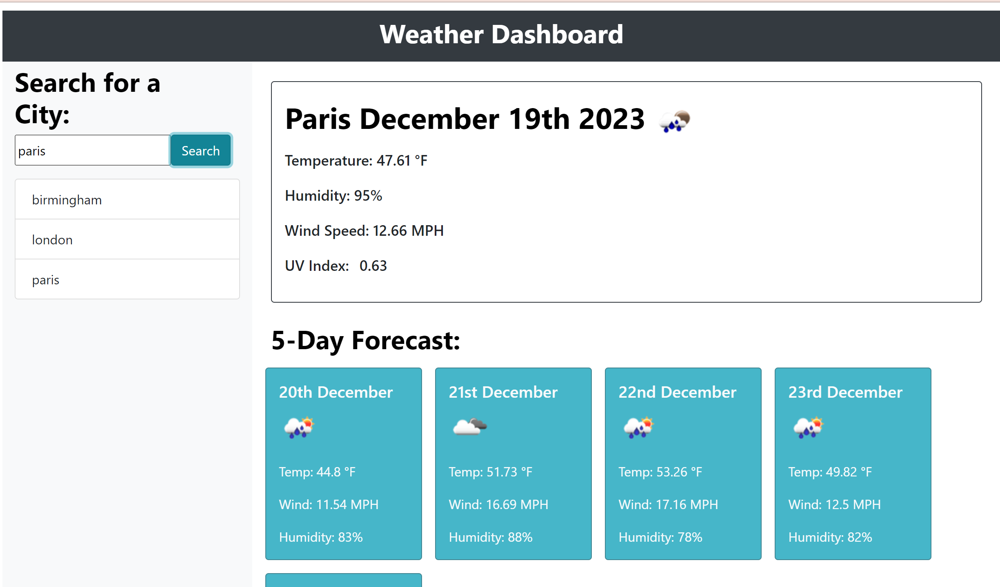

# Weatherforecast

I was required to create a 5 Day Weather forecast that retrieved weather data for cities that:

* Has a dashboard with form inputs.
* Allows a user to search for a city and then see the current weather conditions for that city.
* Allows a user to view future weather conditions for that city and are presented with a 5-day forecast 
* Allows a user to click on a city in the search history and are again presented with current and future conditions for that city

## Installation

To open the project please follow this link: https://anamorai.github.io/Weatherforecast/
## Usage 

Once you open the URL, you will see the following:

## Badges

## Features

* A dashboard with form inputs.
* Allows a user to search for a city and then see the current weather conditions and a 5 day forecast for that city.
* Search history stored in local storage.

## Credits

I would like to refrence my bootcamp course, EdX and my tutor Praktiko for the great lessons provided which gave me the skills necessary to be able to complete this project. I would also like to reference W3Schools for the plethora of information that I have been able to learn from. I would also like to give credit to my tutors for guiding me in this project and being a great support.

## License

MIT License

Copyright (c) [2023] [Anastasia Moraites]

Permission is hereby granted, free of charge, to any person obtaining a copy
of this software and associated documentation files (the "Software"), to deal
in the Software without restriction, including without limitation the rights
to use, copy, modify, merge, publish, distribute, sublicense, and/or sell
copies of the Software, and to permit persons to whom the Software is
furnished to do so, subject to the following conditions:

The above copyright notice and this permission notice shall be included in all
copies or substantial portions of the Software.

THE SOFTWARE IS PROVIDED "AS IS", WITHOUT WARRANTY OF ANY KIND, EXPRESS OR
IMPLIED, INCLUDING BUT NOT LIMITED TO THE WARRANTIES OF MERCHANTABILITY,
FITNESS FOR A PARTICULAR PURPOSE AND NONINFRINGEMENT. IN NO EVENT SHALL THE
AUTHORS OR COPYRIGHT HOLDERS BE LIABLE FOR ANY CLAIM, DAMAGES OR OTHER
LIABILITY, WHETHER IN AN ACTION OF CONTRACT, TORT OR OTHERWISE, ARISING FROM,
OUT OF OR IN CONNECTION WITH THE SOFTWARE OR THE USE OR OTHER DEALINGS IN THE
SOFTWARE.